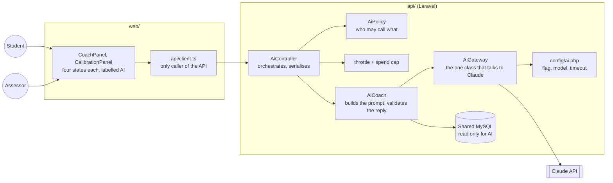
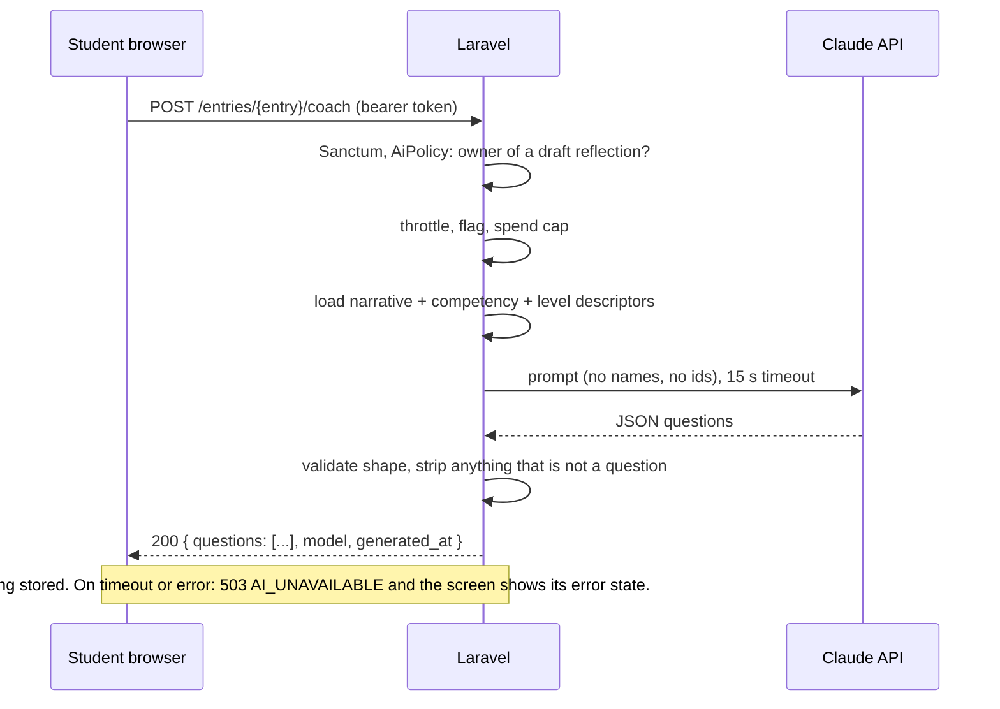

# AI sidecar: feature list and architecture plan

**Status: proposal, nothing built.** This page plans an AI layer for the Reflection Diary
using the Claude API. It is written for the team to decide on, not as a record of a decision.
The product currently has no AI features: they were cut in ADR #10, and building anything
here first needs a superseding record. Estimates are the author's, not measured.

**Timing.** v1.0.0 is planned for 12 October 2026 (README). This is post-release work and
should not touch the release branch.

## 1. Principles

These decide every choice below. They come from the product's own premise, that a machine
can scaffold reflection but never author it.

1. **AI asks, humans write and score.** The AI may ask questions, point at gaps and explain
   data. It never writes a narrative, sets a score, or writes a counter-score comment.
2. **The AI has no write path to any table the product trusts.** `reflections`,
   `reflection_entries`, `scores` and `evidence` are untouched by it.
3. **Laravel is the only front door.** Authorisation stays in `api/app/Policies/` and roles
   in `RoleResolver`. The browser never talks to the AI layer or to Claude.
4. **The diary works with the AI off.** Every AI feature is behind a flag and fails to
   "feature unavailable", never to a broken screen.
5. **Stateless first.** Persist nothing until a feature proves it needs history.
6. **Send the minimum.** Narrative and rubric text only. No names, emails or ids.

## 2. Feature list

Tier 1 is the proposed first release. Tier 2 follows if tier 1 earns it. Tier 3 is
considered and not recommended.

### Tier 1: scaffold the student

| ID | Feature | Who | Input | Output | Notes |
|---|---|---|---|---|---|
| AI-1 | **Reflection coach** | Student, draft entry | Entry narrative, competency name, level descriptors | 2 to 3 probing questions | The core feature. Questions only, never rewrites the text. |
| AI-2 | **Evidence nudge** | Student, draft entry | Narrative, evidence count, self-score | Flags: no concrete example, no outcome, no learning, high self-score with nothing attached | May run in the same call as AI-1. |

### Tier 2: use the data already in the views

| ID | Feature | Who | Input | Output | Notes |
|---|---|---|---|---|---|
| AI-3 | **Calibration coach** | Student, assessed reflection | Rows from `v_calibration_gap` plus the assessor's comment | Reflective questions about why the views differ | Only after assessment, so it cannot anchor the self-score. |
| AI-4 | **Next-sprint focus** | Student | Rows from `v_coverage_gaps` | Suggestions for what evidence to look for | Reads the view, does not aggregate in PHP. |
| AI-5 | **Reviewer summary** | Assessor or supervisor | A submitted narrative, the rubric | A short summary against the level descriptors | Shown beside the narrative, never in place of it. Needs a policy of its own. |

### Tier 3: considered, not recommended

| ID | Feature | Why not |
|---|---|---|
| AI-6 | **Competency or level tagger** | Anchors the student's self-score, which undermines the calibration the radar exists to show. If ever built, show it to the assessor only, or after the student has scored. |
| AI-7 | **Cohort themes, semantic search** | Needs embeddings and persisted data. This is the heaviest part of the cut scope. |
| AI-8 | **Drafting reflections, scores or counter-score comments** | Against principle 1. Do not build. |

## 3. Architecture

### 3.1 Placement options

| Option | Shape | Schema change | New infrastructure | Estimate |
|---|---|---|---|---|
| **A. Inline in Laravel** | A service class in `api/` calls Claude over HTTPS | None | None | 2 to 4 days for tier 1 |
| **B. Second DB connection** | A, plus a second MySQL connection for AI data | None on the product DB | A second MySQL | A plus 2 days |
| **C. Separate AI service** | Laravel calls a service on another VPS that owns its own DB and calls Claude | None on the product DB | A VPS, an app, a DB | 4 to 7 days |

**Recommendation: build A. Choose B or C only if a requirement forces it** (stored history,
or isolating AI code and data from the client's backend). A is a strict subset of the other
two, so nothing built for it is thrown away. Everything below describes A and says where B or
C would differ.

### 3.2 System view (option A)

### 3.3 Request path: AI-1 reflection coach

### 3.4 Components

| Component | Responsibility | Convention it follows |
|---|---|---|
| `AiGateway` | The only code that calls Claude: HTTP, timeout, retry once, key, model name, error mapping | One implementation per rule |
| `AiCoach` | Builds prompts per feature, parses and validates the reply. AI-1 and AI-2 share it | Service class, no HTTP |
| `AiPolicy` | Student who owns the entry may call AI-1 to AI-4; assessor or supervisor on that gig may call AI-5 | Authorisation only in Policies |
| `AiController` | Orchestration only | Controllers do nothing else |
| Form requests | Shape validation | As elsewhere |
| `config/ai.php` | Feature flag, model, timeout, daily cap | Server-side only |
| Frontend panels | Render questions as plain text with all four states | `api/client.ts`, tokens, generated types |
| `docs/openapi.yaml` | Gains the new operations and an `AI_UNAVAILABLE` error code | Contract first |

### 3.5 Proposed API surface (draft, not final)

| Endpoint | Feature | Caller |
|---|---|---|
| `POST /entries/{entry}/coach` | AI-1, AI-2 | Student, draft only |
| `GET /reflections/{reflection}/calibration-coach` | AI-3 | Student, assessed only |
| `GET /me/focus-suggestions` | AI-4 | Student |
| `GET /entries/{entry}/summary` | AI-5 | Assessor, supervisor |

All return the standard error envelope. New codes: `AI_UNAVAILABLE` (503),
`AI_RATE_LIMITED` (429), `AI_DISABLED` (404 when the flag is off).

### 3.6 Data and persistence

| Phase | Stored | Where |
|---|---|---|
| 1 (default) | Nothing returned to the product DB. Request id, feature, model, token counts and latency only, in the application log | Log files |
| 2 (if history or evals are needed) | Suggestions and accept or reject | Option B or C, or one additive table. Never alters existing tables |

Cross-database foreign keys are impossible under B or C, so any stored `entry_id` is a plain
`CHAR(36)` and orphans from deleted drafts need a periodic clean-up.

### 3.7 Option C only: service-to-service

If the separate service is chosen: Laravel stays the only caller, requests are HMAC-signed
with a shared secret, the firewall allows only VPS 1, and the user id travels as a signed
claim. The service never reads the product database; Laravel hands it only what the call
needs. The diary must keep working when the service is down.

## 4. Cross-cutting concerns

**Privacy.** Student narratives are sent to a third party. Needed before launch: client
sign-off, a student opt-in or clear notice, and confirmation of Anthropic's retention terms
for the chosen plan (not verified here). `docs/Retention-and-Erasure.md` says erasure is
not implemented, which matters more once text leaves the system.

**Prompt injection.** A narrative is untrusted input. Treat it as data in the prompt, ask
for structured JSON, validate the reply server-side, and render output as plain text, never
HTML or markdown. A narrative that says "ignore your instructions" should at worst produce
odd questions. It cannot cause a write, because the AI has no write path.

**Cost.** Per-user and per-day throttles, a hard monthly cap on the key, and token counts
logged per call. Prompts are small, so a cheaper model is the default; keep the model name in
config so it can be swapped without a deploy.

**Reliability.** Synchronous call (there is no queue worker, `QUEUE_CONNECTION=sync`, ADR
#30), 15 s timeout, one retry, then `AI_UNAVAILABLE`. A flag turns every feature off at once.
Do not add a worker for this.

**Trust and honesty.** Every AI output is labelled as AI-generated. Feedback never alters
a score or the submit gate. `SubmitGate` and `Scoring` do not know the AI exists.

## 5. Quality and testing

- **Unit and feature tests** in `api/tests/` with `Http::fake()`: policy, throttle, flag off,
  timeout, malformed reply, reply containing something that is not a question.
- **Prompt quality** cannot be unit tested. Build a fixed set of 15 to 20 seeded narratives
  (weak, strong, off-topic, an injection attempt) and read the outputs by hand against a
  short checklist. Keep the set and the checklist in the repository.
- **Browser checks** in `web/e2e/` against the fake API, covering the four states.
- **A smoke step** in `scripts/` that calls the real endpoint once, gated on the key being
  present.

## 6. Phasing

| Phase | Scope | Estimate |
|---|---|---|
| 0 | Decisions in section 8, privacy sign-off, ADR | Team time, not coding |
| 1 | `AiGateway`, `AiCoach`, `POST /entries/{entry}/coach`, CoachPanel, flag, throttle, tests | 2 to 4 days |
| 2 | AI-3 and AI-4, reusing the gateway and the views | 1 to 2 days |
| 3 | History and evals if wanted, via B, C or one additive table | 2 to 5 days |
| 4 | AI-5 reviewer summary, only if assessors ask for it | 1 to 2 days |

## 7. Rejected shapes

- **Browser calls Claude or a sidecar directly:** would duplicate Sanctum, roles and
  policies, and expose the key.
- **AI service reads the product database:** widens the blast radius of a shared database for
  no gain.
- **Queue worker for AI calls:** adds ops for calls that take seconds.
- **Embeddings and a vector store:** the seeded rubrics fit in one prompt. Revisit only for
  SFIA-sized frameworks.

## 8. Open decisions

1. Does the client accept narratives going to Anthropic, and is it opt-in?
2. Students only for the first release, or assessors too?
3. Is feedback available only on drafts, or after submit as well?
4. Is any history needed? If not, stay on option A.
5. Which model and monthly spend cap?
6. Who owns reading the evaluation outputs before each release?
