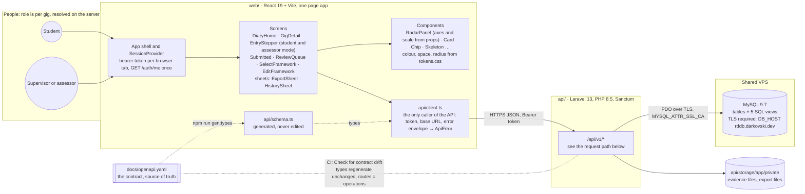
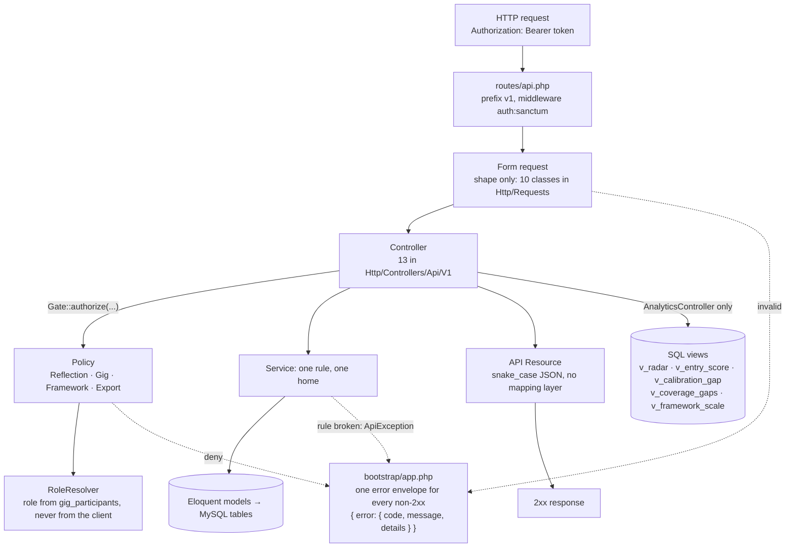

# Architecture

How a request travels through the Reflection Diary, and where each rule and each piece of
data lives. Drawn from the code at `dev` `09a03c5` (2026-10-03), every box and arrow checked
against a file. If the code and this page disagree, the code is right and this page is a bug;
the "Keeping it true" section says how to check.

`docs/Frontend-and-Backend.md` explains the seam in prose. This page is the picture.

## The system



Two things the picture is deliberately showing.

- **The contract sits between the two halves, not inside either.** `schema.ts` is generated
  from it and the API's routes are compared against it in CI
  (`scripts/check-contract-drift.sh`, CAP-25). Neither side writes types for the other.
- **The database is not on anyone's laptop.** Five people and the test suite's own schema
  share one MySQL on the VPS, and it refuses unencrypted connections. A missing CA reads as
  "Access denied", not as a TLS error (`docs/Runbook.md`).

## The request path inside the API

Every `/api/v1` request follows the same order. The layering is the rule in `CLAUDE.md`:
FormRequests check shape, Policies decide who, Services hold business rules, controllers
only orchestrate.



## Which controller uses what

| Controller | Policy check | Service or job | Reads |
| --- | --- | --- | --- |
| `AuthController` | none (it returns the caller) | — | user, participations |
| `GigController` | `view` | — | gigs |
| `ReflectionController` | `createReflection`, `view`, `submit`, `delete` | `ReflectionCreator`, `SubmitGate`, `EventLog` | reflections |
| `EntryController` | `update` | — | entries |
| `EvidenceController` | `update` | — | evidence, local disk |
| `ScoreController` | `update` (self-score), `counterScore` | `Scoring` | scores |
| `ReviewQueueController` | none: the list query is scoped to the caller (ADR #40) | — | reflections |
| `FrameworkController` | `create`, `update` | `FrameworkEditing` | frameworks |
| `CompetencyController`, `LevelController` | `update` | `FrameworkEditing` | competencies, levels |
| `FrameworkAssignmentController` | `assignFramework` | `FrameworkAssigner` | gigs |
| `AnalyticsController` | none: scoped to the caller | — | **SQL views only**, never aggregated in PHP |
| `ExportController` | `export`, `view` | `BuildExport` job → `PdfRenderer` (dompdf) | exports, local disk |

`EventLog` is also called from inside `ReflectionCreator`, `SubmitGate` and `Scoring`, which
is how the history sheet gets its timeline without a controller remembering to write it.

## Where each rule lives

One rule, one class. `./run one-rule` fails CI if a rule's literal is copied elsewhere.

| Rule | Home |
| --- | --- |
| Submit gate: every entry narrated, evidence included | `Services/SubmitGate.php` |
| A lower counter-score needs a comment | `Services/Scoring.php` |
| The level must belong to the entry's competency | `Services/Scoring.php` |
| Assessed once every entry has a counter-score | `Services/Scoring.php` |
| A framework in use is read-only (`409 FRAMEWORK_IN_USE`) | `Services/FrameworkEditing.php` |
| One rubric per gig | `Services/FrameworkAssigner.php` |
| One entry per competency, made on create | `Services/ReflectionCreator.php` |
| Who may do what, on which gig | `Policies/`, through `Services/RoleResolver.php` |
| One reflection per student, gig and sprint | the database: unique index on generated columns, surfaced as `409 DUPLICATE_REFLECTION` |

## Things that are easy to assume wrong

- **Exports run inside the request.** `ExportController` dispatches `BuildExport`, but
  `QUEUE_CONNECTION=sync`, so there is no worker and nothing to supervise. Moving to an
  asynchronous queue means adding a worker and a process supervisor on the host; the
  frontend already polls (`web/src/screens/export-poll.ts`), so it would not notice.
- **The radar is drawn in the browser.** The API returns rows from `v_radar` and
  `v_framework_scale`; `RadarPanel` draws whatever axes and scale it is given, which is why a
  second rubric needs no code change (CAP-20).
- **Files live on the API host's local disk** under `storage/app/private`, not in the
  database. Evidence files have no download route yet (F8 in `docs/Security-Review.md`). A
  deployment must keep that directory across releases (CAP-26).
- **Records outlive people.** `reflections.user_id` and `reflections.gig_id` are
  `ON DELETE RESTRICT`. `docs/Retention-and-Erasure.md` says what that means for erasure.

## Keeping it true

The quickest checks that this page still matches the code:

```bash
php api/artisan route:list --path=api/v1   # controllers and routes
ls api/app/Policies api/app/Services api/app/Http/Requests api/app/Http/Resources
grep -n 'CREATE.*VIEW' db/01-schema.sql    # the SQL views
grep -n 'path=' web/src/app/routes.tsx     # the screens that have routes
```

Update this page in the same pull request as a new controller, service, policy, view or
screen. An architecture diagram generated by a tool from the file tree is a useful first
look, and was compared against this one on 2026-10-03: it missed the policy layer and drew
analytics as reading tables rather than views, which are the two things a maintainer most
needs to get right.
